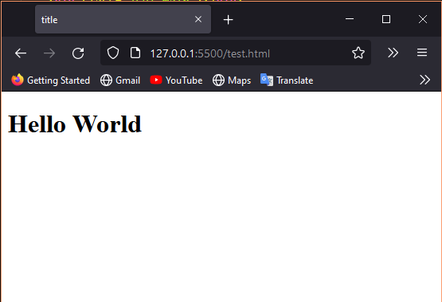
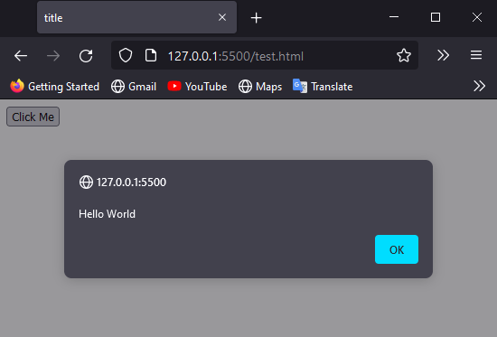
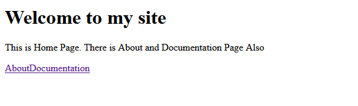
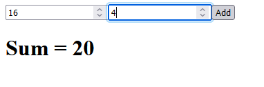

# Welcome to documentation of JSUI


## Getting Started
### -> First Step: download JSUI from github:
[Download JSUI](https://github.com/TanishqDutt/JSUI)

### -> Second Step: 
import JSUI through HTML:
```html
<!DOCTYPE html>
<html lang="en">
<head>
    <title>title</title>
</head>
<body>

    <script src="./jsui.js"></script><!-- Destination for jsui file -->
    <script>
        // Area For our Javascript
    </script>
</body>
</html>
```

### -> Third Step:
add a main `div` in html

```html
<!-- "jsui" class is important -->
<!-- you can change "main" class -->
<div class="jsui main">
```

<hr>
<hr>

## Intializing ```JSUI``` class

### -> Syntax:
```js
let jsui = new JSUI(win)
```

### -> `win` parameter in `JSUI()`
#### win parameter takes the `window` variable of javascript.
#### It is important if you have multiple instance of `window` (like in: `open()`) then it is hard to control.

#### So Correct Example:
```js
let jsui = new JSUI(window)
// now all the methods are in 'jsui' variable
```

<hr>
<hr>

## Hello World Program

### -> Program
```html
<!DOCTYPE html>
<html lang="en">
<head>
    <title>title</title>
</head>
<body>
    <div class="jsui main"></div>
    <!-- Remember 'main'-->


    <script src="./jsui.js"></script>
    <script>
        let jsui = new JSUI(window)

        // next line use 'main'
        let main = jsui.JSUIClassObject("main")

        let text = jsui.Heading({data: "Hello World"})

        jsui.insert(text).to(main)

        
    </script>
</body>
</html>
```
### -> Output
 

<hr>
<hr>

## `insert-to` function:

### -> Syntax:

```js
jsui.insert(elem).to(canvas)
```

### -> `elem` is the element to be inserted. Make sure it is created by JSUI.
### -> `canvas` is the canvas where `elem` is to be placed. You will learn about canvas later

<hr>
<hr>

## `JSUI.Button()`
### `JSUI.Button()` is used to create a buttons
### -> Syntax:
```javascript
let btn = jsui.Button({data, id})
```
### -> `data` parameter in `Button()`:
`data` is text, that is written in button.
### -> `id` parameter in `Button()`: (Not Important)
`id` is the id for button: ```<button id="id"></button>```

### -> Correct Use:
```js
let btn = jsui.Button({data:"Click Me", id:"btn"})
```

<hr>

## `JSUI.Button()` Example:

```js
let jsui = new JSUI(window)

let main = jsui.JSUIClassObject("main")
// main is the instance for <div class="jsui main">

let button = jsui.Button({data: "Click Me"})
button.onclick = function(){
    alert("Hello World")
}

jsui.insert(button).to(main)
```

### -> Output:
 

### After you click 'click me' this alert box apper

<hr>
<hr>

## `JSUI.Heading()`
### `JSUI.Button()` is used to create headings.

### -> Syntax and Example:
```js
let jsui = new JSUI(window)
let main = jsui.JSUIClassObject("main")

// Syntax:
jsui.Heading({ data, id })
    // data: text for heading
    // id: id for html (not important)

// Example:
let heading = jsui.Heading({data:"Chapter 1"})
jsui.insert(heading).to(main)
```

### -> Output:

 

<hr>
<hr>

## `JSUI.JSUIClassObject()`
### `JSUI.JSUIClassObject()` is not complicate by seeing its name. Suppose you type your html in .html file. Now how can you change them with `JSUI` Methods? Simply by `JSUI.JSUIClassObject()`.

### -> Syntax:
#### HTML:
```html
<div class="jsui container"></div>
<!-- Make sure it has jsui class and some other class -->
```
#### Javascript:
```js
let jsui = new JSUI(window)

let cnt = jsui.JSUIClassObject("container")
// now you can use 'cnt' every where in jsui
```

<hr>
<hr>

## `JSUI.Canvas()`

### Canvas can be used in two ways:
- ### You can put some elements in canvas
- ### You can put canvas itself in another canvas.

### -> Syntax:
```js
let canvas = jsui.Canvas({id})
```
#### You will learn some example later.

<hr>
<hr>

## `JSUI.Text()`

### Creates a Basic Text
### -> Syntax and Example
```js
let jsui = new JSUI(window)
let main = jsui.JSUIClassObject("main")

// Syntax:
jsui.Text({ data, id })
    // data: text for text
    // id: id for html (not important)

// Example:
let heading = jsui.Heading({data:"Chapter 1"})
let text = jsui.Text({data:"Some Content"})

jsui.insert(heading).to(main)
jsui.insert(text).to(main)
```

 

<hr>
<hr>

## `JSUI.Image()`

### Creates a Basic Image
### -> Syntax and Example
```js
let jsui = new JSUI(window)
let main = jsui.JSUIClassObject("main")

// Syntax:
jsui.Image({ data, id })
    // data: source for Image (Note: Source must be relative to your html file not js file)
    // id: id for html (not important)

// Example:
let heading = jsui.Heading({data:"Chapter 1"})
let text = jsui.Text({data:"Some Content"})
let img = jsui.Image({data:"./wallpaper.jpg"})
img.height=100

jsui.insert(heading).to(main)
jsui.insert(text).to(main)
jsui.insert(img).to(main)
```

 

<hr>
<hr>

## `JSUI.TextLink()`

### Creates a link. Whenever someone click the link,he/she will be directed to the given destination.
### -> Syntax and Example
```js
let jsui = new JSUI(window)
let main = jsui.JSUIClassObject("main")

// Syntax:
jsui.TextLink({ data, id, dest })
    // data: text for link
    // id: id for html (not important)
    // dest: destination for link. (Note: relative destinations must be relative to html file not js file)

// Example:
let link = jsui.TextLink({
    data:"Google",
    dest: "https://google.com"
})

jsui.insert(link).to(main)
```

 

<hr>
<hr>

## `JSUI.CanvasLink()`

### Creates Canvas with link properties. Whenever someone click any object of the canvaslink he/she will be directed to the given destination
### -> Syntax and Example
```js
let jsui = new JSUI(window)
let main = jsui.JSUIClassObject("main")

// Syntax:
jsui.CanvasLink({ id, dest })
    // id: id for html (not important)
    // dest: destination for link. (Note: relative destinations must be relative to html file not js file)

// Example:
let link = jsui.CanvasLink({
    dest: "https://google.com"
})

jsui.insert(link).to(main)
```

<hr>
<hr>

## `JSUI.InputText()`

### Creates a place where user can write input in text form.
### -> Syntax and Example
```js
let jsui = new JSUI(window)
let main = jsui.JSUIClassObject("main")

// Syntax:
jsui.InputText({ data, id })
    // data: value for our input. (Note: if you want empty input just put "" in data)
    // id: id for html (not important)

// Example:
let inp1 = jsui.InputText({ data: ""})
let inp2 = jsui.InputText({ data: "Coder"})

jsui.insert(inp1).to(main)
jsui.insert(inp2).to(main)
```

 
<hr>
<hr>

## `JSUI.InputNumber()`

### Creates a place where user can write input in number form.
### -> Syntax and Example
```js
let jsui = new JSUI(window)
let main = jsui.JSUIClassObject("main")

// Syntax:
jsui.InputNumber({ data, id })
    // data: value for our input (number). (Note: if you want empty input just put "" in data)
    // id: id for html (not important)

// Example:
let inp1 = jsui.InputText({ data: ""})
let inp2 = jsui.InputText({ data: "Coder"})
let inp3 = jsui.InputNumber({ data: 80 })

jsui.insert(inp1).to(main)
jsui.insert(inp2).to(main)
jsui.insert(inp3).to(main)
```

 
<hr>
<hr>

## `JSUI.InputDate()`

### Creates a place where user can write input in date form.
### -> Syntax and Example
```js
let jsui = new JSUI(window)
let main = jsui.JSUIClassObject("main")

// Syntax:
jsui.InputDate({ id })
    // id: id for html (not important)

// Example:
let inp1 = jsui.InputDate({})

jsui.insert(inp1).to(main)
```

<hr>
<hr>


## `JSUI.InputTime()`

### Creates a place where user can write input in time form.
### -> Syntax and Example
```js
let jsui = new JSUI(window)
let main = jsui.JSUIClassObject("main")

// Syntax:
jsui.InputTime({ id })
    // id: id for html (not important)

// Example:
let inp1 = jsui.InputTime({})

jsui.insert(inp1).to(main)
```

<hr>
<hr>


## `JSUI.InputDateTime()`

### Creates a place where user can write input in Datetime form.
### -> Syntax and Example
```js
let jsui = new JSUI(window)
let main = jsui.JSUIClassObject("main")

// Syntax:
jsui.InputDateTime({ id })
    // id: id for html (not important)

// Example:
let inp1 = jsui.InputDateTime({})

jsui.insert(inp1).to(main)
```

<hr>
<hr>

## `JSUI.JSONtoHTML()`
### Now thats all types of elements in JSUI are done! Here is the fun began. You can convert Javascript objects to HTML with JSUI. It just make the code more readable. Like there are two codes. which code is more readable?:

#### Code 1:
```js
let jsui = new JSUI(window)
let main = jsui.JSUIClassObject("main")

let obj = jsui.JSONtoHTML("contanier", {
    hed_1: ["Heading", "Welcome to my site"],
    txt_1: ["Text", `This is Home Page. There is About and Documentation Page Also`],
    links: ["Canvas", {
        link1: ["TextLink", "About", "./about.html"],
        link2: ["TextLink", `Documentation`, "./doc.html"],
    }]

}) 

jsui.insert(obj).to(main)
```
#### Code 2:
```js
let jsui = new JSUI(window)
let main = jsui.JSUIClassObject("main")

let hed_1 = jsui.Heading({data: "Welcome to my site", id: "hed_1"})
let txt_1 = jsui.Text({data: "This is Home Page. There is About and Documentation Page Also", id: "txt_1"})
let links = jsui.Canvas({id: "links"})
let link1 = jsui.TextLink({data: "About", dest: "./about.html"})
let link2 = jsui.TextLink({data: "Documentation", dest: "./doc.html"})

jsui.insert(link1).to(links)
jsui.insert(link2).to(links)

jsui.insert(hed_1).to(main)
jsui.insert(txt_1).to(main)
jsui.insert(links).to(main)
```

### In code 1 Everything is combined into variable `obj`
### In code 2 Each Element has its own variable and function.

### Ofcourse the output is same:



### In this session you will learn how to create this type of objects.

<hr>

## Syntax:

```js
let elem = jsui.JSONtoHTML(id, obj)
```
### `id` *para*: ``id`` is id to be put in HTML. This time it is neccesary. You can put the js variable in id section.
### `obj` *para*: ``obj`` is the Javascript Object to be covert in a `canvas`

<hr>

## `obj` syntax:

```js
let elem = jsui.JSONtoHTML("elem", {
    idOfElement: ["ElementName", ..args] // Array
})
```

- ### `idOfElem`: `idOfElem` is the `id` of element you need to create.
- ### `ElementName`: `ElementName` is the name of element by JSUI. Like: Text, Image, Canvas etc.
- ### `..args` : `..args` in the array are diffrent arguments taken by diffrent elements. A refrence is shown below

|ElementName|arg1| arg2|
|:---|:----:|:---:|
|Text|data: text|None|
|Image|data: src|None|
|Heading|data: text|None|
|Button|data: text|None|
|Canvas|childs: object for child elements|None|
|TextLink|data: text|dest: href|
|CanvasLink|dest: src|childs: object for child elements|
|InputText|data: text for value|None|
|InputNumber|data: number for value|None|
|InputCheckbox|data: booleon for value|None|
|InputDate|None|None|
|InputTime|None|None|
|InputDateTime|None|None|

<hr>

## Example Program
```js
let jsui = new JSUI(window)
let main = jsui.JSUIClassObject("main")

let obj = {
    a: ["InputNumber", 0],
    b: ["InputNumber", 0],
    btn: ["Button", "Add"],
    output: ["Heading", "Sum = "]
}
let body = jsui.JSONtoHTML("body", obj)

jsui.insert(body).to(main)

btn.onclick = ()=>{
    output.innerHTML = "Sum = "+(Number(a.value)+Number(b.value))
}
```

## Output:



<hr>
<hr>

## `JSUI.injectStyle()`

### This function is used to inject your style in `<head></head>` of your window. Usage is given in next session

<hr>
<hr>

## `Style()` class in JSUI

### Now thats all HTML stuff. But with only HTML you cannot make a webapp exiciting. You need CSS. But with `Style` you can write CSS too in Javascript.

### There are Mainly three functions in `Style`.

<hr>
<hr>

## `Style.propertyName()`

### This function is diffrent. To style `background-color` you cannot write it directly. You need to write `backgroundColor`. This function convert `backgroundColor` to `background-color`.

<hr>

## Usage:

```js
let bg = Style.propertyName("backgroundColor")
console.log(bg)
```

## Output:

```bash
> background-color
```

<hr>
<hr>

## `Style`-sheet constructor (Simple Styling)

### Now thats where hard part comes. You can also write CSS with Javascript Object. But you need to follow some rules.

- Rule One: Each selector should be an Array of two arguments: [query, styling]:
```js
[
    "#box",{
        backgroundColor: 'red',
        color: 'white',
        height: '200px',
        width: '200px'
    }
]
```
- Rule Two: To Manage mulitiple selectors multiply Arrays are enclosed with one master Array:
```js
[
    [
        "#box",{
            backgroundColor: 'red',
            color: 'white',
            height: '200px',
            width: '200px'
        }
    ],
    [
        "#box:hover",{
            backgroundColor: 'white',
            color: 'red'
        }
    ],
]
```
- Rule Three: If you have only one Selector, You still need to enclosed it in master array
```js
[
    [
        "#box",{
            backgroundColor: 'red',
            color: 'white',
            height: '200px',
            width: '200px'
        }
    ]
]
```

- Rule Four: All the css will be written in `<style>`, so you can use pseodo-selectors and some complex selector too.
```js
[
    [
        "#box",{
            backgroundColor: 'grey',
            height: '200px',
            width: '200px'
        }
    ],
    [
        "#box:after",{
            content: '',
            backgroundColor: 'white',
            height: '200px',
            width: '200px'
        }
    ],
]
```

### These are all rules. But even after writing css with `Style()` you cannot you it directly. You can use it with `JSUI.injectStyle()`, you learned earlier:

```js
let jsui = new JSUI(window)
let main = jsui.JSUIClassObject("main")

let html = jsui.JSONtoHTML("html", {
    text: ["Heading", "Hello World"]
})

// use Styling like this:
let css = new Style([
    [
        "#text",{
            backgroundColor: "red",
            color: "white"
        }
    ]
])

// inject styling like this:
jsui.injectStyle(css.html)


    // var.html:
        // return <style>Stylings</style>
    // var.css:
        // return Styling
    // var.js:
        // return Object

    // injectStyle() always needed .html
    

// inserting html:
jsui.insert(html).to(main)
```

<hr>
<hr>

## `Style`-sheet constructor (Animation)

### We all know we can create some powerfull animation with css, using '@keyframes'. but we can also do this with `Style()`. Yes, here too you need to follow some rules:

- Rule One: @keyframes should be in an array in master array.
```js
[
    [
        "#box",{
            backgroundColor: 'red',
            color: 'white',
            height: '200px',
            width: '200px',
            position: "absolute",
        }
    ],
    [
        "@keyframes"
    ]
]
``` 
- Rule Two: This array has three arguments [ "@keyframes", name, frames[] ]
- Rule Three: each frame should be in frames[]. and each frame should be an Array

- Rule Four: Each frame has two args: frame[ frameLocation, Styling{} ]. Styling will be an object of properties and values. frameLocation should be like this: "0%", "90%", "to", "from"
```js
[
    [
        "body",{
            overflow: "hidden",

        }
    ],
    [
        "#box",{
            backgroundColor: 'red',
            color: 'white',
            height: '200px',
            width: '200px',
            position: "absolute",
            animation: "move 5s infinite"
        }
    ],
    [
        "@keyframes","move", [
            [
                "from",{
                    left: '-300px'
                }
            ],
            [
                "to",{
                    left: window.outerWidth + 300 + "px"
                }
            ],
        ]
    ]
]
```


<hr>
<hr>

## `Style.TextToCSS()`

### This function will convert your css written in string to css that can be use with `JSUI.injectStyle()`
### Your css should be in raw form. Means it should look like when you write css in css file or in `<style></style>`

<hr>

## Usage:

```js
let css = `
*{
    marging: 0px;
    padding: 0px;
    box-sizing: border-box;
}
`

jsui.injectStyle(css)
```

<hr>
<hr>

## Some extra functions in `JSUI`

<hr>

## `JSUI.select()`

### This function will return the elements by the id given.

### Usage: 

```html
<div id="block"></div>
```
```js
let jsui = new JSUI(window)
let a = jsui.select("block")
console.log(a)
```

### Output:
```bash
> <div id="block"></div>
```

<hr>

## `JSUI.TextToHTML()`

### This function will convert your html written in string to html that can be use with `JSUI.insert().to()`
### Your html should be in raw form. Means it should look like when you write html in html file or in `<body></body>`

### Usage: 

```html
<div id="block"></div>
```
```js
let jsui = new JSUI(window)
let a = jsui.select("block")
console.log(a)
```

### Output:
```bash
> <div id="block"></div>
```

<hr>

## `JSUI.newClassName()` *For Exprimental*
### This Function will return the The query for elements that have "jsui" class.

### Usage:
```html
<div class="jsui block">
```

```js
let jsui = new JSUI(window)
let a = jsui.newClassName("block")
console.log(a)
```
### Output:
```bash
> .jsui.block
```
<hr>
<hr>


